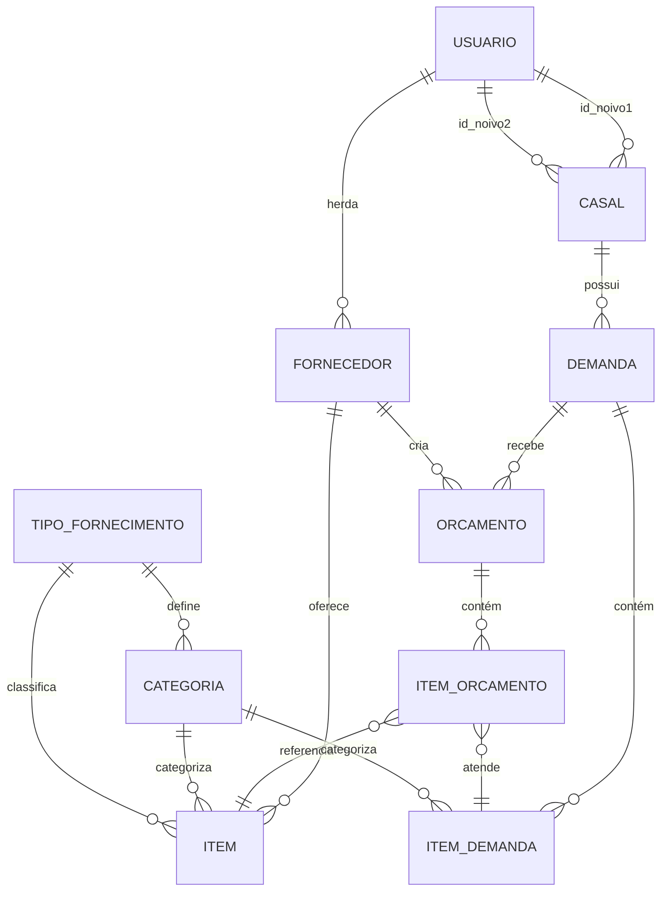

# CaseBem - Sistema de Gestão para Casamentos

[](https://www.python.org/downloads/)
[](https://fastapi.tiangolo.com/)
[](LICENSE)
[](tests/)
[](htmlcov/)

## Índice

- [Sobre o Projeto](#sobre-o-projeto)
- [Tecnologias Utilizadas](#tecnologias-utilizadas)
- [Arquitetura do Sistema](#arquitetura-do-sistema)
- [Modelo de Dados](#modelo-de-dados)
- [Funcionalidades](#funcionalidades)
- [Casos de Uso](#casos-de-uso)
- [Instalação](#instalação)
- [Configuração](#configuração)
- [Executando o Projeto](#executando-o-projeto)
- [Dados de Teste](#dados-de-teste)
- [Testes](#testes)
- [Estrutura de Diretórios](#estrutura-de-diretórios)
- [Contribuindo](#contribuindo)
- [Licença](#licença)

---

## Sobre o Projeto

**CaseBem** é uma plataforma web completa desenvolvida para conectar **casais de noivos** com **fornecedores de serviços para casamentos**. O sistema facilita todo o processo de planejamento de casamentos, desde a criação de demandas até a contratação de fornecedores.

### Instituição
Desenvolvido pelo **IFES - Instituto Federal do Espírito Santo, Campus Cachoeiro de Itapemirim**, como projeto educacional para demonstração de boas práticas de engenharia de software.

### Problema que Resolve
Casais que estão planejando casamentos frequentemente enfrentam dificuldades para:
- Encontrar fornecedores confiáveis de produtos e serviços
- Comparar orçamentos de diferentes fornecedores
- Organizar todas as demandas do casamento em um único lugar
- Gerenciar comunicação com múltiplos fornecedores

### Solução
CaseBem centraliza todo o processo em uma única plataforma onde:
- **Noivos** criam demandas detalhadas do que precisam para o casamento
- **Fornecedores** visualizam demandas, cadastram seus produtos/serviços e enviam orçamentos
- **Administradores** gerenciam a plataforma, verificam fornecedores e moderam conteúdo
- Todos os usuários têm acesso a um marketplace público de produtos, serviços e espaços para casamentos

### Principais Benefícios
- ✅ **Centralização**: Todas as demandas e orçamentos em um só lugar
- ✅ **Transparência**: Comparação fácil entre diferentes orçamentos
- ✅ **Organização**: Sistema de categorias e filtros avançados
- ✅ **Rastreabilidade**: Histórico completo de interações
- ✅ **Segurança**: Verificação de fornecedores pelo administrador
- ✅ **Marketplace**: Catálogo público de produtos, serviços e espaços

---

## Tecnologias Utilizadas

### Backend
- **Python 3.11+** - Linguagem de programação
- **FastAPI** - Framework web moderno e de alta performance
- **Uvicorn** - Servidor ASGI para FastAPI
- **SQLite3** - Banco de dados relacional (com suporte a migrations futuras)
- **Pydantic** - Validação de dados e serialização

### Segurança e Autenticação
- **Passlib + Bcrypt** - Hash seguro de senhas
- **Python-Jose** - JWT tokens para autenticação
- **Itsdangerous** - Tokens seguros para sessões

### Frontend
- **Jinja2** - Template engine para renderização server-side
- **HTML5/CSS3** - Estrutura e estilização
- **JavaScript** - Interatividade no cliente
- **Bootstrap** - Framework CSS responsivo

### Infraestrutura e Utilitários
- **MailerSend** - Envio de emails transacionais (boas-vindas, recuperação de senha)
- **Pillow** - Processamento e manipulação de imagens
- **Babel** - Internacionalização e localização
- **Python-multipart** - Upload de arquivos
- **Python-dotenv** - Gerenciamento de variáveis de ambiente

### Desenvolvimento e Testes
- **Pytest** - Framework de testes (227 testes automatizados)
- **Pytest-asyncio** - Suporte para testes assíncronos
- **Pytest-cov** - Cobertura de código (35% atual)
- **Faker** - Geração de dados falsos para testes
- **Playwright** - Testes end-to-end (E2E)
- **Pyright** - Type checking estático
- **MyPy** - Type checking adicional

---

## Arquitetura do Sistema

O CaseBem segue os princípios de **Clean Architecture** e **Domain-Driven Design (DDD)**, garantindo separação clara de responsabilidades e alta manutenibilidade.

### Estrutura em Camadas

```
┌─────────────────────────────────────────┐
│         Presentation Layer              │
│  (routes/, templates/, static/)         │
│  - FastAPI Routes (Controllers)         │
│  - Jinja2 Templates (Views)             │
│  - Static Assets (CSS, JS, Images)      │
└─────────────────────────────────────────┘
                    ↓
┌─────────────────────────────────────────┐
│         Application Layer               │
│  (dtos/, util/)                         │
│  - Data Transfer Objects (DTOs)         │
│  - Validators                           │
│  - Helper Functions                     │
└─────────────────────────────────────────┘
                    ↓
┌─────────────────────────────────────────┐
│         Domain Layer                    │
│  (core/models/, core/validators/)       │
│  - Business Models                      │
│  - Business Rules                       │
│  - Domain Validators                    │
└─────────────────────────────────────────┘
                    ↓
┌─────────────────────────────────────────┐
│         Data Access Layer               │
│  (core/repositories/, core/sql/)        │
│  - Repository Pattern                   │
│  - SQL Queries                          │
│  - Database Adapters                    │
└─────────────────────────────────────────┘
                    ↓
┌─────────────────────────────────────────┐
│         Infrastructure Layer            │
│  (infrastructure/)                      │
│  - Database Connection                  │
│  - Email Service                        │
│  - Security (Auth, Hashing)             │
│  - Logging                              │
└─────────────────────────────────────────┘
```

### Padrões de Design Utilizados

1. **Repository Pattern**: Abstração do acesso a dados (`core/repositories/`)
2. **Data Transfer Object (DTO)**: Transferência de dados entre camadas (`dtos/`)
3. **Dependency Injection**: Injeção de dependências via FastAPI
4. **Service Layer**: Lógica de negócio isolada (implícito nos repositories)
5. **Factory Pattern**: Criação de objetos complexos (`util/startup.py`)
6. **Decorator Pattern**: Decoradores de autenticação e autorização
7. **Template Method**: Templates Jinja2 com herança

### Fluxo de Dados

```
HTTP Request → Routes (Controller) → DTOs (Validation)
    → Repository (Data Access) → Database
    ← Model (Domain) ← Repository ← Response
```

---

## Modelo de Dados

### Diagrama de Entidades e Relacionamentos



### Entidades Principais

#### 1. **Usuario**
Entidade base para todos os tipos de usuários do sistema.

| Campo              | Tipo      | Descrição                                    |
|--------------------|-----------|----------------------------------------------|
| id                 | INTEGER   | Identificador único (PK)                     |
| nome               | TEXT      | Nome completo do usuário                     |
| cpf                | TEXT      | CPF (opcional)                               |
| data_nascimento    | DATE      | Data de nascimento                           |
| email              | TEXT      | Email único (usado para login)               |
| telefone           | TEXT      | Telefone de contato                          |
| senha              | TEXT      | Hash da senha (bcrypt)                       |
| perfil             | TEXT      | ADMIN, NOIVO ou FORNECEDOR                   |
| token_redefinicao  | TEXT      | Token para recuperação de senha              |
| data_token         | TIMESTAMP | Validade do token de recuperação             |
| data_cadastro      | TIMESTAMP | Data de criação do registro                  |
| ativo              | BOOLEAN   | Status do usuário (ativo/bloqueado)          |

**Enum TipoUsuario:**
- `ADMIN`: Administrador da plataforma
- `NOIVO`: Casal de noivos
- `FORNECEDOR`: Prestador de serviços

#### 2. **Fornecedor**
Herda de Usuario e adiciona informações específicas de fornecedores.

| Campo              | Tipo      | Descrição                                    |
|--------------------|-----------|----------------------------------------------|
| id                 | INTEGER   | FK para Usuario (PK)                         |
| nome_empresa       | TEXT      | Nome fantasia da empresa                     |
| cnpj               | TEXT      | CNPJ da empresa                              |
| descricao          | TEXT      | Descrição do fornecedor                      |
| verificado         | BOOLEAN   | Status de verificação pelo admin             |
| data_verificacao   | TIMESTAMP | Data da verificação                          |
| newsletter         | BOOLEAN   | Aceita receber newsletter                    |

#### 3. **Casal**
Representa um par de noivos cadastrados.

| Campo              | Tipo      | Descrição                                    |
|--------------------|-----------|----------------------------------------------|
| id                 | INTEGER   | Identificador único (PK)                     |
| id_noivo1          | INTEGER   | FK para Usuario (primeiro noivo)             |
| id_noivo2          | INTEGER   | FK para Usuario (segundo noivo, opcional)    |
| data_casamento     | DATE      | Data prevista do casamento                   |
| local_previsto     | TEXT      | Local do casamento                           |
| orcamento_estimado | DECIMAL   | Orçamento total estimado                     |
| numero_convidados  | INTEGER   | Número de convidados esperado                |
| data_cadastro      | TIMESTAMP | Data de criação do registro                  |

#### 4. **Categoria**
Categorias de produtos, serviços e espaços.

| Campo              | Tipo      | Descrição                                    |
|--------------------|-----------|----------------------------------------------|
| id                 | INTEGER   | Identificador único (PK)                     |
| nome               | TEXT      | Nome da categoria                            |
| tipo_fornecimento  | TEXT      | PRODUTO, SERVIÇO ou ESPAÇO                   |
| descricao          | TEXT      | Descrição da categoria                       |
| ativo              | BOOLEAN   | Status da categoria                          |

**Enum TipoFornecimento:**
- `PRODUTO`: Itens físicos (convites, decoração, etc.)
- `SERVICO`: Serviços (fotografia, buffet, etc.)
- `ESPACO`: Locais para eventos (salões, fazendas, etc.)

#### 5. **Item**
Produtos, serviços ou espaços oferecidos por fornecedores.

| Campo              | Tipo      | Descrição                                    |
|--------------------|-----------|----------------------------------------------|
| id                 | INTEGER   | Identificador único (PK)                     |
| id_fornecedor      | INTEGER   | FK para Usuario (fornecedor)                 |
| tipo               | TEXT      | PRODUTO, SERVIÇO ou ESPAÇO                   |
| nome               | TEXT      | Nome do item                                 |
| descricao          | TEXT      | Descrição detalhada                          |
| preco              | DECIMAL   | Preço do item                                |
| id_categoria       | INTEGER   | FK para Categoria                            |
| observacoes        | TEXT      | Observações adicionais                       |
| ativo              | BOOLEAN   | Status do item                               |
| data_cadastro      | TIMESTAMP | Data de criação                              |

#### 6. **Demanda**
Solicitação criada por um casal de noivos.

| Campo              | Tipo      | Descrição                                    |
|--------------------|-----------|----------------------------------------------|
| id                 | INTEGER   | Identificador único (PK)                     |
| id_casal           | INTEGER   | FK para Casal                                |
| descricao          | TEXT      | Descrição geral da demanda                   |
| orcamento_total    | DECIMAL   | Orçamento total disponível                   |
| data_casamento     | DATE      | Data do casamento (preenchido automaticamente)|
| cidade_casamento   | TEXT      | Cidade do casamento                          |
| prazo_entrega      | TEXT      | Prazo desejado                               |
| status             | TEXT      | ATIVA, FINALIZADA ou CANCELADA               |
| data_criacao       | TIMESTAMP | Data de criação                              |
| observacoes        | TEXT      | Observações adicionais                       |

**Enum StatusDemanda:**
- `ATIVA`: Demanda aberta para receber orçamentos
- `FINALIZADA`: Demanda concluída
- `CANCELADA`: Demanda cancelada

#### 7. **ItemDemanda**
Itens específicos solicitados em uma demanda.

| Campo              | Tipo      | Descrição                                    |
|--------------------|-----------|----------------------------------------------|
| id                 | INTEGER   | Identificador único (PK)                     |
| id_demanda         | INTEGER   | FK para Demanda                              |
| tipo               | TEXT      | PRODUTO, SERVIÇO ou ESPAÇO                   |
| id_categoria       | INTEGER   | FK para Categoria                            |
| descricao          | TEXT      | Descrição livre do que deseja                |
| quantidade         | INTEGER   | Quantidade solicitada                        |
| preco_maximo       | DECIMAL   | Preço máximo que aceita pagar                |
| observacoes        | TEXT      | Observações adicionais                       |

**Observação:** ItemDemanda NÃO está vinculado a um item específico do catálogo. É uma descrição livre do que o noivo deseja. O fornecedor vinculará seus itens no orçamento.

#### 8. **Orcamento**
Resposta de um fornecedor a uma demanda.

| Campo                     | Tipo      | Descrição                                    |
|---------------------------|-----------|----------------------------------------------|
| id                        | INTEGER   | Identificador único (PK)                     |
| id_demanda                | INTEGER   | FK para Demanda                              |
| id_fornecedor_prestador   | INTEGER   | FK para Usuario (fornecedor)                 |
| data_hora_cadastro        | TIMESTAMP | Data/hora de criação                         |
| data_hora_validade        | TIMESTAMP | Validade do orçamento                        |
| status                    | TEXT      | Status derivado dos itens                    |
| observacoes               | TEXT      | Observações do fornecedor                    |
| valor_total               | DECIMAL   | Valor total calculado                        |

**Enum StatusOrcamento:**
- `PENDENTE`: Aguardando decisão do noivo
- `ACEITO`: Orçamento aceito integralmente
- `REJEITADO`: Orçamento rejeitado integralmente
- `PARCIALMENTE_ACEITO`: Alguns itens aceitos, outros rejeitados

#### 9. **ItemOrcamento**
Itens específicos incluídos em um orçamento.

| Campo              | Tipo      | Descrição                                    |
|--------------------|-----------|----------------------------------------------|
| id                 | INTEGER   | Identificador único (PK)                     |
| id_orcamento       | INTEGER   | FK para Orcamento                            |
| id_item_demanda    | INTEGER   | FK para ItemDemanda (item atendido)          |
| id_item            | INTEGER   | FK para Item (do catálogo)                   |
| quantidade         | INTEGER   | Quantidade oferecida                         |
| preco_unitario     | DECIMAL   | Preço unitário                               |
| observacoes        | TEXT      | Observações do fornecedor                    |
| desconto           | DECIMAL   | Desconto aplicado                            |
| status             | TEXT      | PENDENTE, ACEITO ou REJEITADO                |
| motivo_rejeicao    | TEXT      | Motivo quando rejeitado                      |

**Flexibilidade de Quantidade:**
- ItemDemanda pede X unidades
- ItemOrcamento pode oferecer Y unidades (mais ou menos)
- Cabe ao noivo decidir se aceita a quantidade oferecida

### Relacionamentos Principais

1. **Usuario → Fornecedor**: Herança (1:1)
2. **Usuario → Casal**: Um usuário pode ser noivo em um casal (N:1)
3. **Casal → Demanda**: Um casal pode criar várias demandas (1:N)
4. **Demanda → ItemDemanda**: Uma demanda contém vários itens (1:N)
5. **Demanda → Orcamento**: Uma demanda pode receber vários orçamentos (1:N)
6. **Fornecedor → Orcamento**: Um fornecedor pode criar vários orçamentos (1:N)
7. **Fornecedor → Item**: Um fornecedor oferece vários itens (1:N)
8. **Orcamento → ItemOrcamento**: Um orçamento contém vários itens (1:N)
9. **ItemOrcamento → ItemDemanda**: Cada item do orçamento atende um item da demanda (N:1)
10. **ItemOrcamento → Item**: Cada item do orçamento referencia um item do catálogo (N:1)

---

## Funcionalidades

### Área Pública (Visitantes)

#### Navegação e Informações
- **GET /** - Home page com apresentação da plataforma
- **GET /sobre** - Página sobre o projeto
- **GET /contato** - Página de contato

#### Autenticação
- **GET /login** - Página de login
- **POST /login** - Processar login
- **GET /logout** - Realizar logout
- **GET /esqueci-senha** - Página de recuperação de senha
- **POST /esqueci-senha** - Enviar email de recuperação
- **GET /reset-senha?token=...** - Página de redefinição de senha
- **POST /reset-senha** - Processar nova senha

#### Cadastro
- **GET /cadastro** - Escolher tipo de cadastro
- **GET /cadastro-noivos** - Formulário de cadastro de casal
- **POST /cadastro-noivos** - Processar cadastro de casal
- **GET /cadastro-fornecedor** - Formulário de cadastro de fornecedor
- **POST /cadastro-fornecedor** - Processar cadastro de fornecedor
- **GET /cadastro_geral** - Cadastro simplificado
- **POST /cadastro_geral** - Processar cadastro simplificado

#### Marketplace Público
- **GET /itens** - Listar todos os itens com filtros e busca
  - Parâmetros: `tipo`, `busca`, `categoria`, `pagina`
- **GET /produtos** - Redireciona para /itens?tipo=produto
- **GET /servicos** - Redireciona para /itens?tipo=servico
- **GET /espacos** - Redireciona para /itens?tipo=espaco
- **GET /locais** - Alias para /espacos
- **GET /item/{id}** - Detalhes de um item específico
- **GET /produtos/{id}** - Redireciona para /item/{id}
- **GET /servicos/{id}** - Redireciona para /item/{id}
- **GET /espacos/{id}** - Redireciona para /item/{id}

### Área do Administrador

#### Dashboard
- **GET /admin** - Redireciona para dashboard
- **GET /admin/dashboard** - Dashboard com estatísticas
  - Total de usuários (por perfil)
  - Total de demandas
  - Total de orçamentos
  - Total de itens ativos
  - Fornecedores pendentes de verificação
  - Gráficos e métricas

#### Gestão de Perfil
- **GET /admin/perfil** - Visualizar e editar perfil
- **POST /admin/perfil** - Atualizar dados do perfil
- **POST /perfil/alterar-foto** - Upload de foto de perfil
- **POST /perfil/remover-foto** - Remover foto de perfil

#### Gestão de Usuários
- **GET /admin/usuarios** - Listar todos os usuários
  - Filtros: tipo de usuário, busca, status (ativo/inativo)
  - Paginação
- **GET /admin/usuarios/{id}** - Detalhes de um usuário
- **POST /admin/usuarios/{id}/bloquear** - Bloquear usuário
- **POST /admin/usuarios/{id}/ativar** - Ativar usuário bloqueado

#### Gestão de Administradores
- **GET /admin/usuarios/novo-admin** - Formulário de novo admin
- **POST /admin/usuarios/criar-admin** - Criar novo admin
- **GET /admin/usuarios/editar-admin/{id}** - Editar admin existente
- **POST /admin/usuarios/atualizar-admin/{id}** - Atualizar admin

#### Verificação de Fornecedores
- **GET /admin/verificacao** - Lista de fornecedores pendentes
- **GET /admin/verificacao/{id}** - Detalhes do fornecedor
- **POST /admin/verificacao/{id}/aprovar** - Aprovar fornecedor
- **POST /admin/verificacao/{id}/rejeitar** - Rejeitar fornecedor

#### Gestão de Itens
- **GET /admin/itens** - Listar todos os itens
  - Filtros: tipo, categoria, status, fornecedor
  - Paginação
- **GET /admin/item/{id}** - Detalhes de um item
- **GET /admin/item/{id}/ativar** - Ativar item
- **GET /admin/item/{id}/desativar** - Desativar item

#### Gestão de Categorias
- **GET /admin/categorias** - Listar categorias
  - Filtros por tipo de fornecimento
- **GET /admin/categoria/nova** - Formulário de nova categoria
- **POST /admin/categoria/criar** - Criar categoria
- **GET /admin/categoria/editar/{id}** - Editar categoria
- **POST /admin/categoria/atualizar/{id}** - Atualizar categoria
- **POST /admin/categoria/excluir/{id}** - Excluir categoria
- **GET /admin/categoria/{id}/ativar** - Ativar categoria
- **GET /admin/categoria/{id}/desativar** - Desativar categoria

#### Relatórios
- **GET /admin/relatorios** - Dashboard de relatórios
  - Relatório de usuários por perfil
  - Relatório de demandas por status
  - Relatório de orçamentos por status
  - Relatório de itens por categoria
  - Relatório de fornecedores verificados
- **GET /admin/relatorios/exportar** - Exportar relatórios
  - Formatos: CSV, JSON

### Área do Noivo

#### Dashboard
- **GET /noivo** - Redireciona para dashboard
- **GET /noivo/dashboard** - Dashboard personalizado
  - Resumo das demandas
  - Orçamentos pendentes
  - Orçamentos aceitos/rejeitados
  - Próximos passos

#### Gestão de Perfil
- **GET /noivo/perfil** - Visualizar e editar perfil do casal
- **POST /noivo/perfil** - Atualizar dados do casal
  - Nome dos noivos
  - Data do casamento
  - Local previsto
  - Orçamento estimado
  - Número de convidados
- **POST /perfil/alterar-foto** - Upload de foto de perfil
- **POST /perfil/remover-foto** - Remover foto de perfil

#### Gestão de Demandas
- **GET /noivo/demandas** - Listar minhas demandas
  - Filtros por status
  - Paginação
- **GET /noivo/demandas/nova** - Formulário de nova demanda
- **POST /noivo/demandas/nova** - Criar demanda
  - Descrição geral
  - Orçamento total
  - Prazo de entrega
  - Lista de itens desejados (dinâmica)
- **GET /noivo/demandas/{id}** - Detalhes da demanda
  - Itens solicitados
  - Orçamentos recebidos
  - Status atual
- **GET /noivo/demandas/editar/{id}** - Editar demanda existente
- **POST /noivo/demandas/editar/{id}** - Atualizar demanda
- **POST /noivo/demandas/{id}/excluir** - Excluir demanda

#### Gestão de Orçamentos
- **GET /noivo/orcamentos** - Listar orçamentos recebidos
  - Filtros por status, fornecedor, demanda
  - Paginação
- **GET /noivo/orcamentos/{id}** - Detalhes do orçamento
  - Itens oferecidos
  - Preços e quantidades
  - Informações do fornecedor
  - Comparação com outros orçamentos
- **POST /noivo/orcamentos/{id}/item/{item_id}/aceitar** - Aceitar item
- **POST /noivo/orcamentos/{id}/item/{item_id}/rejeitar** - Rejeitar item
  - Requer motivo da rejeição

### Área do Fornecedor

#### Dashboard
- **GET /fornecedor** - Redireciona para dashboard
- **GET /fornecedor/dashboard** - Dashboard personalizado
  - Total de itens cadastrados
  - Demandas disponíveis
  - Orçamentos enviados
  - Taxa de aceitação
  - Estatísticas de vendas

#### Gestão de Perfil
- **GET /fornecedor/perfil** - Visualizar e editar perfil
- **POST /fornecedor/perfil** - Atualizar dados do fornecedor
  - Nome pessoal
  - Nome da empresa
  - CNPJ
  - Descrição
  - Contatos
- **POST /perfil/alterar-foto** - Upload de foto de perfil
- **POST /perfil/remover-foto** - Remover foto de perfil

#### Gestão de Itens (Catálogo)
- **GET /fornecedor/itens** - Listar meus itens
  - Filtros por tipo, categoria, status
  - Busca
  - Paginação
- **GET /fornecedor/itens/novo** - Formulário de novo item
- **POST /fornecedor/itens/novo** - Criar item
  - Tipo (PRODUTO/SERVIÇO/ESPAÇO)
  - Nome e descrição
  - Preço
  - Categoria
  - Upload de foto
- **GET /fornecedor/itens/{id}/editar** - Editar item
- **POST /fornecedor/itens/{id}/editar** - Atualizar item
- **POST /fornecedor/itens/{id}/excluir** - Excluir item
- **POST /fornecedor/itens/{id}/ativar** - Ativar item
- **POST /fornecedor/itens/{id}/desativar** - Desativar item
- **POST /fornecedor/itens/{id}/alterar-foto** - Alterar foto do item
- **POST /fornecedor/itens/{id}/remover-foto** - Remover foto do item

#### Visualização de Demandas
- **GET /fornecedor/demandas** - Listar demandas ativas
  - Filtros por categoria, cidade, data
  - Busca
  - Paginação
  - Exibe apenas demandas ATIVAS

#### Gestão de Orçamentos
- **GET /fornecedor/orcamentos** - Listar meus orçamentos
  - Filtros por status, demanda
  - Paginação
- **GET /fornecedor/orcamentos/{id}** - Detalhes do orçamento enviado
  - Status de cada item
  - Feedback do noivo
- **GET /fornecedor/demandas/{id_demanda}/orcamento/novo** - Formulário de novo orçamento
  - Lista itens da demanda
  - Permite selecionar itens do catálogo para cada item da demanda
- **POST /fornecedor/demandas/{id_demanda}/orcamento** - Criar orçamento
  - Itens oferecidos (do catálogo)
  - Quantidades
  - Preços unitários
  - Descontos
  - Observações
- **GET /fornecedor/orcamentos/{id}/editar** - Editar orçamento existente
- **POST /fornecedor/orcamentos/{id}** - Atualizar orçamento

### Funcionalidades Transversais

#### Autenticação e Autorização
- Sistema de sessões com SessionMiddleware
- Hash de senhas com Bcrypt
- Decoradores de autenticação (@requer_autenticacao)
- Controle de acesso por perfil (ADMIN, NOIVO, FORNECEDOR)
- Redirecionamento automático para dashboard específico após login

#### Upload de Imagens
- Upload de fotos de perfil de usuários
- Upload de fotos de itens
- Validação de tipo e tamanho
- Armazenamento em `static/img/usuarios/` e `static/img/itens/`
- Processamento com Pillow

#### Notificações
- Flash messages para feedback ao usuário
- Categorias: sucesso, erro, aviso, informação
- Persistência entre requisições

#### Emails Transacionais
- Email de boas-vindas após cadastro
- Email de recuperação de senha com token
- Integração com MailerSend

#### Paginação
- Paginação em todas as listagens
- Tamanho de página configurável
- Links para próxima/anterior/primeira/última página
- Total de páginas e registros

#### Busca e Filtros
- Busca textual em itens, demandas, usuários
- Filtros por categoria, tipo, status
- Filtros por data
- Combinação de múltiplos filtros

#### Logging
- Sistema de logging estruturado
- Níveis: DEBUG, INFO, WARNING, ERROR
- Logs de ações importantes (login, cadastro, criação de demanda, etc.)
- Logs de erros com contexto

---

## Casos de Uso

### UC01: Cadastro e Autenticação

#### Fluxo Principal - Cadastro de Casal
1. Visitante acessa /cadastro
2. Escolhe "Cadastro de Noivos"
3. Preenche formulário com dados dos dois noivos:
   - Nome completo de cada noivo
   - Email individual para cada um
   - Telefone de cada noivo
   - Senha compartilhada para ambos
   - Dados do casamento (data, local, orçamento, número de convidados)
4. Sistema valida dados:
   - Emails únicos
   - CPF válido (se fornecido)
   - Telefone no formato correto
   - Senha forte (mínimo 8 caracteres, letras e números)
   - Confirmação de senha
5. Sistema cria dois usuários com perfil NOIVO
6. Sistema cria registro de CASAL vinculando os dois noivos
7. Sistema envia emails de boas-vindas para ambos
8. Redireciona para página de login

#### Fluxo Principal - Login
1. Usuário acessa /login
2. Informa email e senha
3. Sistema valida credenciais
4. Sistema cria sessão
5. Redireciona para dashboard específico do perfil:
   - ADMIN → /admin/dashboard
   - FORNECEDOR → /fornecedor/dashboard
   - NOIVO → /noivo/dashboard

#### Fluxo Alternativo - Recuperação de Senha
1. Usuário clica em "Esqueci minha senha"
2. Informa email cadastrado
3. Sistema gera token único de 6 horas de validade
4. Sistema envia email com link de recuperação
5. Usuário clica no link
6. Sistema valida token
7. Usuário informa nova senha
8. Sistema atualiza senha e invalida token
9. Redireciona para login

### UC02: Criação de Demanda pelo Casal

#### Pré-condição
- Casal autenticado como NOIVO

#### Fluxo Principal
1. Noivo acessa /noivo/demandas/nova
2. Sistema exibe formulário de criação de demanda
3. Noivo preenche:
   - Descrição geral da demanda
   - Orçamento total disponível
   - Prazo desejado de entrega
   - Observações gerais
4. Sistema preenche automaticamente:
   - Data do casamento (do cadastro do casal)
   - Cidade do casamento (do cadastro do casal)
5. Noivo adiciona itens à demanda (dinamicamente):
   - Para cada item:
     - Tipo (PRODUTO/SERVIÇO/ESPAÇO)
     - Categoria
     - Descrição livre do que deseja
     - Quantidade
     - Preço máximo que aceita pagar
     - Observações específicas
6. Sistema valida dados
7. Sistema cria registro de DEMANDA
8. Sistema cria registros de ITEM_DEMANDA para cada item
9. Sistema define status como ATIVA
10. Sistema exibe mensagem de sucesso
11. Demanda fica visível para fornecedores

#### Exemplo Prático
```
Demanda: "Casamento Rústico na Praia - 150 convidados"
Orçamento Total: R$ 50.000,00
Prazo: 15/06/2025

Itens da Demanda:
1. PRODUTO - Convites
   - Categoria: Papelaria
   - Quantidade: 200 unidades
   - Preço máximo: R$ 10,00/unidade
   - Descrição: "Convites em papel reciclado, tema praia"

2. SERVIÇO - Fotografia
   - Categoria: Fotografia
   - Quantidade: 1 pacote
   - Preço máximo: R$ 5.000,00
   - Descrição: "Fotografia + filmagem completa do evento"

3. ESPAÇO - Salão de Festas
   - Categoria: Espaços
   - Quantidade: 1 diária
   - Preço máximo: R$ 15.000,00
   - Descrição: "Espaço à beira-mar com capacidade para 150 pessoas"
```

### UC03: Fornecedor Envia Orçamento

#### Pré-condição
- Fornecedor autenticado e verificado
- Demanda ATIVA disponível
- Fornecedor possui itens no catálogo

#### Fluxo Principal
1. Fornecedor acessa /fornecedor/demandas
2. Sistema exibe lista de demandas ativas
3. Fornecedor filtra por categoria ou cidade de interesse
4. Fornecedor visualiza detalhes de uma demanda
5. Fornecedor clica em "Criar Orçamento"
6. Sistema exibe formulário de orçamento:
   - Lista todos os itens da demanda
   - Para cada item da demanda, exibe itens do catálogo do fornecedor que correspondem
7. Fornecedor seleciona itens do seu catálogo para atender cada item da demanda:
   - Seleciona item do catálogo
   - Define quantidade oferecida
   - Define preço unitário (pode ser diferente do catálogo)
   - Aplica desconto (opcional)
   - Adiciona observações
8. Sistema calcula valor total automaticamente
9. Fornecedor adiciona observações gerais do orçamento
10. Fornecedor define data de validade do orçamento
11. Sistema valida dados
12. Sistema cria registro de ORCAMENTO
13. Sistema cria registros de ITEM_ORCAMENTO para cada item
14. Sistema define status como PENDENTE
15. Sistema exibe mensagem de sucesso
16. Orçamento fica visível para o casal

#### Exemplo Prático
```
Orçamento para: "Casamento Rústico na Praia"
Fornecedor: Fotografia Premium LTDA

Itens Oferecidos:
1. Atende: "Fotografia + filmagem completa"
   - Item do Catálogo: "Pacote Gold - Casamento Completo"
   - Quantidade oferecida: 1 pacote
   - Preço unitário: R$ 4.500,00
   - Desconto: R$ 500,00
   - Subtotal: R$ 4.000,00
   - Observação: "Inclui 2 fotógrafos, 1 cinegrafista, álbum premium"

Valor Total: R$ 4.000,00
Validade: 30 dias
Observações Gerais: "Orçamento inclui ensaio pré-wedding como cortesia"
```

### UC04: Noivo Avalia Orçamento

#### Pré-condição
- Noivo autenticado
- Orçamento recebido com status PENDENTE

#### Fluxo Principal
1. Noivo acessa /noivo/orcamentos
2. Sistema exibe lista de orçamentos recebidos
3. Noivo visualiza detalhes de um orçamento
4. Sistema exibe:
   - Informações do fornecedor
   - Data de envio e validade
   - Itens oferecidos com preços
   - Valor total
   - Comparação com outros orçamentos da mesma demanda
5. Noivo avalia cada item individualmente:
   - **Aceitar item**: Sistema marca item como ACEITO
   - **Rejeitar item**: Sistema solicita motivo e marca como REJEITADO
6. Sistema recalcula status do orçamento:
   - Todos itens ACEITOS → ACEITO
   - Todos itens REJEITADOS → REJEITADO
   - Misto → PARCIALMENTE_ACEITO
7. Sistema exibe mensagem de sucesso
8. Fornecedor pode visualizar feedback

#### Exemplo Prático
```
Orçamento #123 - Fotografia Premium LTDA

Item 1: Pacote Gold - Casamento Completo
Status: ✅ ACEITO
Motivo: "Preço justo e boa avaliação no portfolio"

Item 2: Decoração Rústica Premium
Status: ❌ REJEITADO
Motivo: "Preço acima do orçamento disponível"

Status do Orçamento: PARCIALMENTE_ACEITO
```

### UC05: Administrador Verifica Fornecedor

#### Pré-condição
- Admin autenticado
- Fornecedor cadastrado não verificado

#### Fluxo Principal
1. Admin acessa /admin/verificacao
2. Sistema exibe lista de fornecedores pendentes de verificação
3. Admin seleciona um fornecedor
4. Sistema exibe:
   - Dados cadastrais completos
   - CNPJ
   - Descrição da empresa
   - Data de cadastro
   - Itens já cadastrados (se houver)
5. Admin analisa informações e decide:
   - **Aprovar**: Sistema marca fornecedor como verificado, permite participar de demandas
   - **Rejeitar**: Sistema envia notificação e impede participação em demandas
6. Sistema registra data e hora da verificação
7. Sistema exibe mensagem de sucesso

### UC06: Fornecedor Gerencia Catálogo

#### Pré-condição
- Fornecedor autenticado

#### Fluxo Principal - Adicionar Item
1. Fornecedor acessa /fornecedor/itens/novo
2. Sistema exibe formulário
3. Fornecedor preenche:
   - Tipo (PRODUTO/SERVIÇO/ESPAÇO)
   - Nome do item
   - Descrição detalhada
   - Preço
   - Categoria
   - Observações
   - Upload de foto
4. Sistema valida dados
5. Sistema cria registro de ITEM
6. Sistema processa e salva foto
7. Item fica disponível no catálogo público
8. Item pode ser usado em orçamentos

#### Fluxo Alternativo - Editar Item
1. Fornecedor acessa /fornecedor/itens
2. Seleciona item existente
3. Clica em "Editar"
4. Altera dados desejados
5. Sistema valida e atualiza

#### Fluxo Alternativo - Desativar Item
1. Fornecedor acessa /fornecedor/itens
2. Seleciona item ativo
3. Clica em "Desativar"
4. Item sai do catálogo público
5. Item não pode mais ser usado em novos orçamentos
6. Orçamentos existentes permanecem inalterados

### UC07: Busca Pública de Itens

#### Pré-condição
- Nenhuma (área pública)

#### Fluxo Principal
1. Visitante acessa /itens
2. Sistema exibe catálogo público com:
   - Todos os itens ativos
   - Paginação (12 itens por página)
   - Filtros disponíveis
3. Visitante pode aplicar filtros:
   - **Por tipo**: PRODUTO, SERVIÇO ou ESPAÇO
   - **Por categoria**: Convites, Decoração, Fotografia, etc.
   - **Por busca textual**: Nome ou descrição
4. Sistema aplica filtros e retorna resultados
5. Visitante clica em um item
6. Sistema exibe detalhes completos:
   - Fotos
   - Descrição completa
   - Preço
   - Informações do fornecedor
   - Categoria
7. Visitante pode:
   - Voltar para listagem
   - Ver outros itens do mesmo fornecedor
   - Ver itens da mesma categoria

#### Exemplo de Uso
```
Busca: "fotografia"
Filtro: SERVIÇO
Categoria: Fotografia

Resultados:
1. Pacote Gold - Casamento Completo | R$ 4.500,00
   Fotografia Premium LTDA
   ⭐⭐⭐⭐⭐ Verificado

2. Ensaio Fotográfico Pré-Wedding | R$ 1.200,00
   Studio Art Fotos
   ⭐⭐⭐⭐ Verificado

3. Fotografia + Filmagem Básica | R$ 3.000,00
   Momentos Eternos
   Novo Fornecedor
```

---

## Instalação

### Pré-requisitos

- **Python 3.11 ou superior** instalado
- **Git** para clonar o repositório
- **pip** (gerenciador de pacotes Python)
- **virtualenv** ou **venv** (recomendado)
- Conta no **MailerSend** (para envio de emails)

### Passo 1: Clonar o Repositório

```bash
git clone https://github.com/ifes-serra/casebem.git
cd casebem
```

### Passo 2: Criar Ambiente Virtual

#### Linux/macOS
```bash
python3 -m venv .venv
source .venv/bin/activate
```

#### Windows
```bash
python -m venv .venv
.venv\Scripts\activate
```

### Passo 3: Instalar Dependências

```bash
# Dependências principais
pip install -r requirements.txt

# Ou usando pyproject.toml
pip install -e .

# Dependências de desenvolvimento (opcional)
pip install -e ".[dev]"

# Dependências de testes E2E (opcional)
pip install -e ".[e2e]"
```

### Passo 4: Verificar Instalação

```bash
# Verificar versão do Python
python --version  # Deve ser 3.11+

# Verificar instalação do FastAPI
python -c "import fastapi; print(fastapi.__version__)"

# Listar pacotes instalados
pip list
```

---

## Configuração

### Passo 1: Configurar Variáveis de Ambiente

Copie o arquivo `.env.example` para `.env`:

```bash
cp .env.example .env
```

Edite o arquivo `.env` com suas configurações:

```env
# Ambiente (development ou production)
ENVIRONMENT=development

# Banco de dados (SQLite)
DATABASE_URL=sqlite:///dados.db

# Debug (true para desenvolvimento)
DEBUG=true

# Chave secreta para sessões (MUDE EM PRODUÇÃO!)
SECRET_KEY=sua-chave-secreta-muito-segura-aqui

# Configurações de Email (MailerSend)
RESEND_API_KEY=sua-chave-api-mailersend
SENDER_EMAIL=contato@seudominio.com
SENDER_NAME="Case Bem"
BASE_URL=https://seudominio.com
```

### Passo 2: Inicializar Banco de Dados

O banco de dados é inicializado automaticamente na primeira execução. O sistema irá:

1. Criar todas as tabelas necessárias
2. Criar administrador padrão
3. Criar categorias padrão
4. (Opcional) Importar dados de teste dos arquivos JSON em `data/seeds/`

**Credenciais do Administrador Padrão:**
- **Email:** `admin@casebem.com`
- **Senha:** `1234aA@#`

⚠️ **IMPORTANTE:** Altere a senha do administrador no primeiro login!

### Passo 3: (Opcional) Configurar Dados de Teste

Se desejar popular o banco com dados de teste, certifique-se de que os arquivos JSON estão presentes em `data/seeds/`:

```
data/seeds/
├── usuarios.json          # Usuários noivos de teste
├── fornecedores.json      # Fornecedores de exemplo
├── categorias.json        # Categorias padrão
├── itens.json             # Itens de exemplo
├── casais.json            # Casais de teste
├── demandas.json          # Demandas de exemplo
├── itens_demandas.json    # Itens das demandas
├── orcamentos.json        # Orçamentos de exemplo
└── itens_orcamentos.json  # Itens dos orçamentos
```

O sistema detecta automaticamente esses arquivos e importa os dados na primeira execução.

### Passo 4: Configurar Email (MailerSend)

1. Crie uma conta em [MailerSend](https://www.mailersend.com/)
2. Gere uma API Key
3. Configure um domínio verificado
4. Adicione as credenciais no `.env`:
   ```env
   RESEND_API_KEY=sua-chave-api-aqui
   SENDER_EMAIL=noreply@seudominio.com
   ```

Se não configurar o email, o sistema funcionará normalmente, mas não enviará emails de:
- Boas-vindas após cadastro
- Recuperação de senha

---

## Executando o Projeto

### Modo Desenvolvimento

```bash
# Ativar ambiente virtual (se ainda não estiver ativo)
source .venv/bin/activate  # Linux/macOS
.venv\Scripts\activate      # Windows

# Executar servidor de desenvolvimento
python main.py
```

Ou usando Uvicorn diretamente:

```bash
uvicorn main:app --host 127.0.0.1 --port 8001 --reload
```

O sistema estará disponível em: **http://127.0.0.1:8001**

**Flags úteis:**
- `--reload`: Recarrega automaticamente ao detectar mudanças no código
- `--port 8001`: Define a porta (padrão: 8001)
- `--host 0.0.0.0`: Permite acesso externo (útil para testes em rede local)

### Modo Produção

Para produção, recomenda-se usar Gunicorn com workers Uvicorn:

```bash
# Instalar Gunicorn
pip install gunicorn

# Executar com múltiplos workers
gunicorn main:app \
  --workers 4 \
  --worker-class uvicorn.workers.UvicornWorker \
  --bind 0.0.0.0:8000 \
  --access-logfile - \
  --error-logfile -
```

### Docker (Opcional)

Um arquivo `Dockerfile` está incluído no projeto:

```bash
# Build da imagem
docker build -t casebem:latest .

# Executar container
docker run -d \
  -p 8001:8001 \
  --env-file .env \
  --name casebem \
  casebem:latest
```

### Acessando o Sistema

Após iniciar o servidor, acesse:

- **Home Pública:** http://127.0.0.1:8001/
- **Login:** http://127.0.0.1:8001/login
- **Admin:** http://127.0.0.1:8001/admin/dashboard
  - Email: `admin@casebem.com`
  - Senha: `1234aA@#`
- **Documentação Interativa (Swagger):** http://127.0.0.1:8001/docs
- **Documentação Alternativa (ReDoc):** http://127.0.0.1:8001/redoc

---

## Dados de Teste

### Administrador Padrão

Sempre criado automaticamente na primeira execução:

| Campo | Valor |
|-------|-------|
| Email | admin@casebem.com |
| Senha | 1234aA@# |
| Perfil | ADMIN |

### Usuários de Teste (Seeds)

Se os arquivos JSON estiverem presentes em `data/seeds/`, o sistema importa automaticamente:

- **~50 usuários noivos** (casais de teste)
- **10+ fornecedores** verificados
- **80+ itens** (produtos, serviços, espaços)
- **10+ casais** cadastrados
- **20+ demandas** ativas
- **50+ orçamentos** de exemplo

**Senha padrão para todos os usuários de teste:** `1234aA@#`

### Categorias Padrão

O sistema cria automaticamente categorias para casamentos:

**Produtos:**
- Convites e Papelaria
- Decoração
- Lembrancinhas
- Vestuário

**Serviços:**
- Fotografia
- Buffet e Catering
- Música e DJ
- Beleza e Estética

**Espaços:**
- Salões de Festa
- Espaços ao Ar Livre
- Hotéis e Pousadas

### Limpando o Banco de Dados

Para resetar o banco de dados:

```bash
# Deletar banco existente
rm dados.db

# Reiniciar aplicação para recriar
python main.py
```

---

## Testes

O projeto possui uma suíte abrangente de testes automatizados.

### Estrutura de Testes

```
tests/
├── test_auth.py                 # Testes de autenticação
├── test_base_repo.py            # Testes do repositório base
├── test_casal_repo.py           # Testes do repositório de casais
├── test_categoria_repo.py       # Testes do repositório de categorias
├── test_demanda_repo.py         # Testes do repositório de demandas
├── test_fornecedor_repo.py      # Testes do repositório de fornecedores
├── test_item_demanda_repo.py    # Testes dos itens de demanda
├── test_item_orcamento_repo.py  # Testes dos itens de orçamento
├── test_item_repo.py            # Testes do repositório de itens
├── test_orcamento_repo.py       # Testes do repositório de orçamentos
├── test_pagination.py           # Testes de paginação
├── test_senha_util.py           # Testes de utilitários de senha
├── test_startup.py              # Testes de inicialização
├── test_usuario_repo.py         # Testes do repositório de usuários
├── test_validacoes_dto.py       # Testes de validações
├── conftest.py                  # Fixtures globais
└── README.md                    # Documentação dos testes
```

### Executando Testes

```bash
# Executar todos os testes
pytest

# Executar com verbosidade
pytest -v

# Executar testes específicos
pytest tests/test_auth.py
pytest tests/test_usuario_repo.py::TestUsuarioRepo::test_inserir

# Executar por marcadores
pytest -m unit          # Apenas testes unitários
pytest -m integration   # Apenas testes de integração
pytest -m slow          # Apenas testes lentos

# Executar com cobertura
pytest --cov=. --cov-report=html
# Relatório gerado em htmlcov/index.html
```

### Cobertura de Código

```bash
# Gerar relatório de cobertura
pytest --cov=. --cov-report=term-missing

# Gerar relatório HTML
pytest --cov=. --cov-report=html
open htmlcov/index.html  # Abrir no navegador
```

**Cobertura Atual:** 35% (em constante melhoria)

### Testes E2E (Playwright)

```bash
# Instalar Playwright (primeira vez)
playwright install

# Executar testes E2E
pytest -m e2e

# Executar com interface gráfica
pytest -m e2e --headed

# Debug de testes E2E
pytest -m e2e --headed --slowmo=1000
```

### Marcadores de Testes

- `@pytest.mark.unit` - Testes unitários rápidos
- `@pytest.mark.integration` - Testes de integração
- `@pytest.mark.e2e` - Testes end-to-end
- `@pytest.mark.slow` - Testes que demoram mais de 1 segundo

### Convenções de Testes

- Nomenclatura: `test_<funcao>_<cenario>.py`
- Organize por módulo testado
- Use fixtures do `conftest.py`
- Docstrings em todos os testes
- Assertions claras e específicas

---

## Estrutura de Diretórios

```
CaseBem/
│
├── .venv/                      # Ambiente virtual Python (não versionado)
├── .git/                       # Controle de versão Git
├── .pytest_cache/              # Cache do Pytest
├── htmlcov/                    # Relatórios de cobertura de testes
│
├── config/                     # Configurações gerais (se houver)
│
├── core/                       # Camada de domínio (Domain Layer)
│   ├── models/                 # Modelos de domínio (Entities)
│   │   ├── usuario_model.py
│   │   ├── fornecedor_model.py
│   │   ├── casal_model.py
│   │   ├── categoria_model.py
│   │   ├── item_model.py
│   │   ├── demanda_model.py
│   │   ├── item_demanda_model.py
│   │   ├── orcamento_model.py
│   │   └── item_orcamento_model.py
│   │
│   ├── repositories/           # Camada de acesso a dados (Repository Pattern)
│   │   ├── base_repo.py
│   │   ├── usuario_repo.py
│   │   ├── fornecedor_repo.py
│   │   ├── casal_repo.py
│   │   ├── categoria_repo.py
│   │   ├── item_repo.py
│   │   ├── demanda_repo.py
│   │   ├── item_demanda_repo.py
│   │   ├── orcamento_repo.py
│   │   └── item_orcamento_repo.py
│   │
│   ├── validators/             # Validadores de domínio
│   │   └── usuario_validator.py
│   │
│   └── sql/                    # Queries SQL organizadas
│       ├── usuario_sql.py
│       ├── fornecedor_sql.py
│       ├── casal_sql.py
│       ├── categoria_sql.py
│       ├── item_sql.py
│       ├── demanda_sql.py
│       ├── item_demanda_sql.py
│       ├── orcamento_sql.py
│       └── item_orcamento_sql.py
│
├── dtos/                       # Data Transfer Objects (Application Layer)
│   ├── base_dto.py
│   ├── usuario_dtos.py
│   ├── noivos_dtos.py
│   ├── categoria_dtos.py
│   ├── item_dtos.py
│   └── orcamento_dtos.py
│
├── infrastructure/             # Camada de infraestrutura
│   ├── database/
│   │   ├── connection.py       # Conexão com banco de dados
│   │   └── adapters.py         # Adaptadores de tipos
│   │
│   ├── email/
│   │   ├── email_config.py     # Configuração de email
│   │   └── email_service.py    # Serviço de envio de emails
│   │
│   ├── logging/
│   │   └── logger.py           # Configuração de logging
│   │
│   └── security/
│       ├── security.py         # Hash, tokens, validações
│       └── auth_decorator.py   # Decoradores de autenticação
│
├── routes/                     # Camada de apresentação (Controllers)
│   ├── public_routes.py        # Rotas públicas (home, login, cadastro)
│   ├── admin_routes.py         # Rotas do administrador
│   ├── fornecedor_routes.py    # Rotas do fornecedor
│   ├── noivo_routes.py         # Rotas dos noivos
│   └── usuario_routes.py       # Rotas comuns a todos usuários
│
├── templates/                  # Templates Jinja2 (Views)
│   ├── publico/
│   │   ├── home.html
│   │   ├── login.html
│   │   ├── cadastro.html
│   │   ├── itens.html
│   │   └── ...
│   │
│   ├── admin/
│   │   ├── dashboard.html
│   │   ├── usuarios.html
│   │   ├── categorias.html
│   │   └── ...
│   │
│   ├── fornecedor/
│   │   ├── dashboard.html
│   │   ├── itens.html
│   │   ├── orcamentos.html
│   │   └── ...
│   │
│   ├── noivo/
│   │   ├── dashboard.html
│   │   ├── demandas.html
│   │   ├── orcamentos.html
│   │   └── ...
│   │
│   ├── usuario/
│   │   ├── perfil.html
│   │   └── alterar_senha.html
│   │
│   ├── components/             # Componentes reutilizáveis
│   │   ├── navbar.html
│   │   ├── footer.html
│   │   ├── flash_messages.html
│   │   └── pagination.html
│   │
│   └── emails/                 # Templates de emails
│       ├── boas_vindas.html
│       └── recuperacao_senha.html
│
├── static/                     # Arquivos estáticos
│   ├── css/
│   │   ├── styles.css
│   │   └── ...
│   │
│   ├── js/
│   │   ├── main.js
│   │   └── ...
│   │
│   └── img/
│       ├── usuarios/           # Fotos de perfil
│       ├── itens/              # Fotos de itens
│       ├── logos/              # Logos do sistema
│       └── pages/              # Imagens das páginas
│
├── util/                       # Utilitários gerais
│   ├── startup.py              # Inicialização do sistema e seeds
│   ├── usuario_util.py         # Utilitários de usuário
│   ├── flash_messages.py       # Sistema de mensagens flash
│   ├── template_helpers.py     # Helpers para templates
│   ├── error_handlers.py       # Tratamento de erros
│   ├── pagination.py           # Paginação
│   └── validacoes_dto.py       # Validações customizadas
│
├── data/                       # Dados e seeds
│   └── seeds/                  # Arquivos JSON para popular banco
│       ├── usuarios.json
│       ├── fornecedores.json
│       ├── categorias.json
│       ├── itens.json
│       ├── casais.json
│       ├── demandas.json
│       ├── itens_demandas.json
│       ├── orcamentos.json
│       └── itens_orcamentos.json
│
├── tests/                      # Testes automatizados
│   ├── conftest.py             # Fixtures globais
│   ├── test_auth.py
│   ├── test_usuario_repo.py
│   ├── test_categoria_repo.py
│   └── ...
│
├── main.py                     # Ponto de entrada da aplicação
├── pyproject.toml              # Configuração do projeto (PEP 517/518)
├── requirements.txt            # Dependências Python
├── pytest.ini                  # Configuração do Pytest
├── .coveragerc                 # Configuração de cobertura
├── pyrightconfig.json          # Configuração do Pyright
├── mypy.ini                    # Configuração do MyPy
├── .env                        # Variáveis de ambiente (não versionado)
├── .env.example                # Exemplo de variáveis de ambiente
├── .gitignore                  # Arquivos ignorados pelo Git
├── Dockerfile                  # Configuração Docker
├── README.md                   # Este arquivo
└── dados.db                    # Banco de dados SQLite (não versionado)
```

### Convenções de Nomenclatura

- **Arquivos Python**: `snake_case.py`
- **Classes**: `PascalCase`
- **Funções e métodos**: `snake_case()`
- **Constantes**: `UPPER_CASE`
- **Templates**: `snake_case.html`
- **Variáveis de ambiente**: `UPPER_CASE`

---

## Contribuindo

Contribuições são bem-vindas! Este é um projeto educacional com o objetivo de demonstrar boas práticas de desenvolvimento.

### Como Contribuir

1. **Fork o projeto**
2. **Crie uma branch para sua feature**
   ```bash
   git checkout -b feature/minha-feature
   ```
3. **Faça commit das suas mudanças**
   ```bash
   git commit -m "feat: Adiciona funcionalidade X"
   ```
4. **Push para a branch**
   ```bash
   git push origin feature/minha-feature
   ```
5. **Abra um Pull Request**

### Padrões de Código

- **PEP 8**: Siga o guia de estilo Python
- **Type Hints**: Use type hints sempre que possível
- **Docstrings**: Documente funções, classes e módulos
- **Testes**: Adicione testes para novas funcionalidades
- **Commits**: Use [Conventional Commits](https://www.conventionalcommits.org/)
  - `feat:` Nova funcionalidade
  - `fix:` Correção de bug
  - `docs:` Documentação
  - `refactor:` Refatoração
  - `test:` Adição de testes
  - `chore:` Tarefas gerais

### Executando Verificações

Antes de enviar um PR, execute:

```bash
# Verificar type hints
pyright .

# Verificar com MyPy
mypy .

# Executar testes
pytest

# Verificar cobertura
pytest --cov=. --cov-report=term-missing
```

### Reportando Bugs

Use as [Issues do GitHub](https://github.com/ifes-serra/casebem/issues) para reportar bugs.

Inclua:
- Descrição clara do problema
- Passos para reproduzir
- Comportamento esperado vs. obtido
- Screenshots (se aplicável)
- Versão do Python e dependências

---

## Licença

Este projeto é propriedade do **IFES - Instituto Federal do Espírito Santo, Campus Cachoeiro de Itapemirim** e é disponibilizado apenas para fins educacionais.

**Proprietary License - IFES Campus Cachoeiro**

Todos os direitos reservados © 2025 IFES.

---

## Autores e Créditos

### Instituição
**IFES - Instituto Federal do Espírito Santo**
- Campus: Cachoeiro de Itapemirim
- Site: https://cachoeiro.ifes.edu.br

### Desenvolvedores
Projeto desenvolvido como demonstração educacional de boas práticas de engenharia de software.

### Tecnologias e Bibliotecas
Agradecimentos especiais aos criadores e mantenedores de:
- FastAPI - [Sebastián Ramírez (tiangolo)](https://github.com/tiangolo)
- Python Software Foundation
- Todas as bibliotecas de código aberto utilizadas

---

## FAQ (Perguntas Frequentes)

### 1. Por que SQLite e não PostgreSQL/MySQL?
SQLite é perfeito para desenvolvimento e demonstração educacional. É leve, não requer instalação separada e facilita o setup. Para produção em larga escala, recomenda-se PostgreSQL.

### 2. O sistema suporta múltiplos idiomas?
Atualmente está em português (Brasil). A estrutura com Babel permite internacionalização futura.

### 3. Como faço backup do banco de dados?
```bash
cp dados.db dados_backup_$(date +%Y%m%d).db
```

### 4. Posso usar em produção?
O sistema é funcional, mas foi desenvolvido para fins educacionais. Para produção, recomenda-se:
- Migrar para PostgreSQL
- Implementar HTTPS
- Configurar firewall
- Implementar rate limiting
- Adicionar mais testes
- Melhorar segurança

### 5. Como altero a porta do servidor?
Edite `main.py` e altere o parâmetro `port=8001` para a porta desejada.

### 6. O sistema tem API REST?
Sim! FastAPI gera automaticamente uma API REST. Acesse `/docs` para documentação interativa.

### 7. Como adiciono novas categorias?
Como administrador, acesse `/admin/categorias` e clique em "Nova Categoria".

---

## Suporte e Contato

### Reportar Problemas
- GitHub Issues: https://github.com/ifes-serra/casebem/issues

### Discussões
- GitHub Discussions: https://github.com/ifes-serra/casebem/discussions

### Contato Institucional
- Email: contato@serra.ifes.edu.br
- Site: https://cachoeiro.ifes.edu.br

---

## Roadmap Futuro

Funcionalidades planejadas para versões futuras:

- [ ] Sistema de avaliações e comentários
- [ ] Chat em tempo real entre noivos e fornecedores
- [ ] Integração com pagamento online
- [ ] App mobile (React Native)
- [ ] Sistema de notificações push
- [ ] Agenda integrada com Google Calendar
- [ ] Dashboard de análise para fornecedores
- [ ] Geração de contrato automático
- [ ] Sistema de cupons e promoções
- [ ] Integração com redes sociais
- [ ] Exportação de relatórios em PDF
- [ ] API pública documentada
- [ ] Webhooks para integração externa

---

## Changelog

### v2.0.0 (Atual)
- ✨ Refatoração completa da arquitetura
- ✨ Sistema de demandas e orçamentos V2
- ✨ Marketplace público de itens
- ✨ Sistema de aceitar/rejeitar itens individualmente
- ✨ Verificação de fornecedores
- 🐛 Correção de 94% dos problemas técnicos
- 📝 Documentação completa
- ✅ 227 testes automatizados
- 🎨 Interface melhorada

### v1.0.0
- Versão inicial do sistema

---

**Desenvolvido com ❤️ pelo IFES Campus Cachoeiro de Itapemirim**

*Última atualização: Janeiro de 2025*
