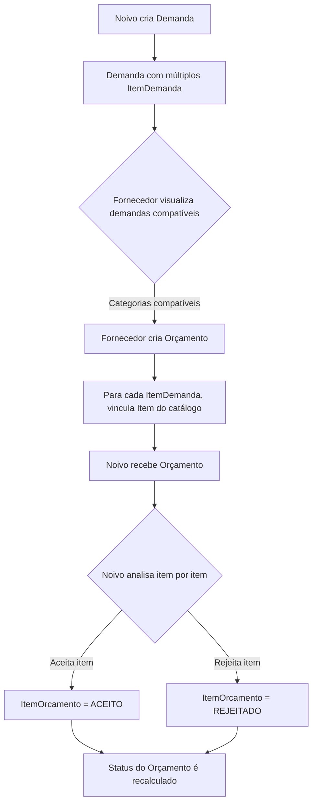

# Arquitetura do Sistema de Demandas e Orçamentos

## 📋 Visão Geral

Este documento descreve a arquitetura e regras de negócio do sistema de demandas e orçamentos do CaseBem.

**Versão Atual**: V3 (Status individual por item)
**Última Atualização**: 2025-10-09

---

## 🎯 Conceitos Principais

### 1. **Demanda**
Solicitação criada por um casal de noivos descrevendo o que precisam para o casamento.

**Características**:
- Uma demanda possui **múltiplos itens** (ItemDemanda)
- Cada item é uma **descrição livre** do que o noivo quer
- NÃO vincula diretamente itens do catálogo de fornecedores
- Possui status: ATIVA, FINALIZADA, CANCELADA

### 2. **ItemDemanda**
Descrição específica de um item solicitado dentro de uma demanda.

**Características**:
- Descrição livre (texto) do que o noivo quer
- Vincula tipo (PRODUTO/SERVICO/ESPACO) + categoria
- Quantidade desejada e preço máximo (opcional)
- NÃO vincula item específico do catálogo

**Exemplo**:
```
ItemDemanda {
  tipo: "PRODUTO",
  categoria: "Convites",
  descricao: "Convites impressos em papel kraft com envelope",
  quantidade: 150,
  preco_maximo: 500.00
}
```

### 3. **Orçamento**
Proposta enviada por um fornecedor para atender uma demanda.

**Características**:
- Vincula fornecedor + demanda
- Contém múltiplos itens (ItemOrcamento)
- Status é **derivado** dos status dos itens
- Valor total é **calculado** dos itens aceitos

**Status Possíveis**:
- `PENDENTE`: Todos os itens pendentes
- `ACEITO`: Todos os itens aceitos
- `REJEITADO`: Todos os itens rejeitados
- `PARCIALMENTE_ACEITO`: Alguns aceitos, outros não

### 4. **ItemOrcamento**
Item específico do catálogo do fornecedor oferecido para atender um ItemDemanda.

**Características**:
- Vincula: Orçamento → ItemDemanda → Item do Catálogo
- Possui **status individual**: PENDENTE, ACEITO, REJEITADO
- Quantidade oferecida pode diferir da solicitada (flexibilidade)
- Preço unitário, desconto e observações

**Exemplo**:
```
ItemOrcamento {
  id_orcamento: 123,
  id_item_demanda: 456,  // Vincula qual item da demanda está atendendo
  id_item: 789,           // Item específico do catálogo do fornecedor
  quantidade: 150,
  preco_unitario: 3.00,
  desconto: 50.00,
  status: "PENDENTE"
}
```

---

## 🔄 Fluxo Completo



---

## 📐 Modelagem de Dados

### Relacionamentos

```
Casal 1----* Demanda
Demanda 1----* ItemDemanda
Demanda 1----* Orcamento
Fornecedor 1----* Orcamento
Orcamento 1----* ItemOrcamento
ItemDemanda 1----* ItemOrcamento
Item (Catálogo) 1----* ItemOrcamento
```

### Tabelas Principais

#### `demanda`
```sql
CREATE TABLE demanda (
    id INTEGER PRIMARY KEY,
    id_casal INTEGER NOT NULL,
    descricao TEXT NOT NULL,              -- Descrição geral
    orcamento_total DECIMAL(10,2),        -- Orçamento total (opcional)
    data_casamento DATE,                  -- Preenchida do casal
    cidade_casamento VARCHAR(255),        -- Preenchida do casal
    prazo_entrega VARCHAR(255),
    status VARCHAR(20) DEFAULT 'ATIVA',   -- ATIVA, FINALIZADA, CANCELADA
    data_criacao TIMESTAMP,
    observacoes TEXT
)
```

#### `item_demanda`
```sql
CREATE TABLE item_demanda (
    id INTEGER PRIMARY KEY,
    id_demanda INTEGER NOT NULL,
    tipo VARCHAR(20) NOT NULL,            -- PRODUTO, SERVICO, ESPACO
    id_categoria INTEGER NOT NULL,
    descricao TEXT NOT NULL,              -- Descrição LIVRE do item
    quantidade INTEGER DEFAULT 1,
    preco_maximo REAL,
    observacoes TEXT
)
```

#### `orcamento`
```sql
CREATE TABLE orcamento (
    id INTEGER PRIMARY KEY,
    id_demanda INTEGER NOT NULL,
    id_fornecedor_prestador INTEGER NOT NULL,
    data_hora_cadastro TIMESTAMP,
    data_hora_validade TIMESTAMP,
    status TEXT DEFAULT 'PENDENTE',       -- Derivado dos itens
    observacoes TEXT,
    valor_total REAL                      -- Soma dos itens ACEITOS
)
```

#### `item_orcamento`
```sql
CREATE TABLE item_orcamento (
    id INTEGER PRIMARY KEY,
    id_orcamento INTEGER NOT NULL,
    id_item_demanda INTEGER NOT NULL,     -- Qual item da demanda está atendendo
    id_item INTEGER NOT NULL,             -- Item do catálogo do fornecedor
    quantidade INTEGER DEFAULT 1,
    preco_unitario REAL NOT NULL,
    observacoes TEXT,
    desconto REAL DEFAULT 0,
    status TEXT DEFAULT 'PENDENTE',       -- PENDENTE, ACEITO, REJEITADO
    UNIQUE(id_orcamento, id_item_demanda, id_item)  -- Previne duplicatas
)
```

---

## ⚖️ Regras de Negócio

### RN001: Criação de Demandas
- ✅ Noivo DEVE estar associado a um casal
- ✅ Demanda DEVE ter pelo menos 1 ItemDemanda
- ✅ ItemDemanda usa descrições livres (não vincula catálogo)
- ✅ data_casamento e cidade_casamento são preenchidas automaticamente do casal

### RN002: Visualização de Demandas (Fornecedor)
- ✅ Fornecedor vê apenas demandas com itens de categorias que ele atende
- ✅ Filtro: ItemDemanda.id_categoria IN (categorias do fornecedor)
- ✅ Mostra quais itens da demanda ele pode atender

### RN003: Criação de Orçamentos
- ✅ Fornecedor DEVE vincular cada ItemDemanda a um Item do seu catálogo
- ✅ Item do catálogo DEVE ser da mesma categoria do ItemDemanda
- ✅ Mesmo item NÃO pode ser usado duas vezes para o mesmo ItemDemanda
- ✅ Fornecedor pode enviar apenas 1 orçamento por demanda

### RN004: Flexibilidade de Quantidade
- ✅ **DECISÃO DE NEGÓCIO**: Quantidade oferecida pode diferir da solicitada
- ✅ Noivo pede 100 convites → Fornecedor pode oferecer pacote de 150
- ✅ Cabe ao noivo decidir se aceita a quantidade oferecida

### RN005: Aceitação de Orçamentos (MAIS IMPORTANTE)
- ✅ Noivo aceita/rejeita **ITEM POR ITEM**, não o orçamento inteiro
- ✅ Noivo pode aceitar itens de **diferentes fornecedores**
- ❌ Noivo NÃO pode aceitar 2 itens para o mesmo ItemDemanda
- ✅ Status do Orçamento é **calculado automaticamente** dos itens

### RN006: Cálculo de Status Derivado
```python
def calcular_status_orcamento(id_orcamento):
    total_aceitos = count(status='ACEITO')
    total_rejeitados = count(status='REJEITADO')
    total_pendentes = count(status='PENDENTE')
    total_itens = total_aceitos + total_rejeitados + total_pendentes

    if total_itens == 0:
        return "PENDENTE"
    if total_aceitos == total_itens:
        return "ACEITO"
    if total_rejeitados == total_itens:
        return "REJEITADO"
    if total_pendentes == total_itens:
        return "PENDENTE"
    if total_aceitos > 0:
        return "PARCIALMENTE_ACEITO"
    return "PENDENTE"
```

### RN007: Cálculo de Valor Total
- ✅ `valor_total` = SOMA(preco_total dos itens com status='ACEITO')
- ✅ Itens pendentes ou rejeitados NÃO contam no total
- ✅ Recalculado automaticamente ao aceitar/rejeitar item

---

## 🏗️ Camadas da Arquitetura

### 1. **Models** (`core/models/`)
- `Demanda`: Entidade de negócio
- `ItemDemanda`: Descrição livre de item solicitado
- `Orcamento`: Proposta do fornecedor
- `ItemOrcamento`: Vínculo item_demanda → item_catálogo

### 2. **Repositories** (`core/repositories/`)
- `DemandaRepo`: CRUD + queries específicas
- `ItemDemandaRepo`: CRUD + busca compatibilidade
- `OrcamentoRepo`: CRUD + status derivado
- `ItemOrcamentoRepo`: CRUD + validações

**Métodos Importantes**:
- `obter_demandas_compativeis_com_fornecedor(categorias_fornecedor)`
- `calcular_status_derivado(id_orcamento)`
- `verificar_item_demanda_ja_aceito(id_item_demanda)`

### 3. **Services** (`core/services/`)
- `DemandaService`: Lógica de negócio de demandas
- `OrcamentoService`: Lógica de aceitação/rejeição

**Métodos Importantes**:
- `aceitar_item_orcamento(id_item, id_orcamento)` ⭐
- `rejeitar_item_orcamento(id_item, id_orcamento)` ⭐
- `criar_orcamento_com_itens(...)` ⭐

### 4. **Routes** (`routes/`)
- `noivo_routes.py`: Criação de demandas, aceitação de itens
- `fornecedor_routes.py`: Visualização de demandas, criação de orçamentos

---

## 🎨 Interfaces de Usuário

### Tela: Listar Demandas (Noivo)
**Informações Mostradas**:
- Descrição da demanda
- Total de itens solicitados
- Quantos itens foram atendidos (têm item aceito)
- Percentual de atendimento
- Quantos orçamentos recebeu

**Cálculos**:
```python
itens_atendidos = count(ItemOrcamento where status='ACEITO' for each ItemDemanda)
total_itens = count(ItemDemanda)
percentual = (itens_atendidos / total_itens) * 100
```

### Tela: Visualizar Orçamento (Noivo)
**Funcionalidades**:
- Ver todos os itens do orçamento
- Aceitar/Rejeitar cada item individualmente
- Ver descrição do ItemDemanda que o item atende
- Status atualizado automaticamente

### Tela: Listar Demandas (Fornecedor)
**Filtros**:
- Apenas demandas com itens de categorias que ele atende
- Mostra quais itens ele pode fornecer
- Indica se já enviou orçamento

### Tela: Criar Orçamento (Fornecedor)
**Processo**:
1. Vê lista de ItemDemanda compatíveis
2. Para cada ItemDemanda, seleciona Item do seu catálogo
3. Define quantidade, preço, desconto
4. Submete orçamento completo

---

## 🔍 Queries SQL Importantes

### Buscar Demandas Compatíveis com Fornecedor
```sql
SELECT DISTINCT id_demanda
FROM item_demanda
WHERE tipo = ? AND id_categoria IN (?, ?, ...)
```

### Verificar se ItemDemanda já foi Aceito
```sql
SELECT COUNT(*) as count
FROM item_orcamento
WHERE id_item_demanda = ? AND status = 'ACEITO'
```

### Obter Itens do Orçamento com Detalhes
```sql
SELECT
    io.*,
    i.nome as item_nome,
    id.descricao as item_demanda_descricao,
    c.nome as categoria_nome,
    (io.quantidade * io.preco_unitario - COALESCE(io.desconto, 0)) as preco_total
FROM item_orcamento io
JOIN item i ON io.id_item = i.id
JOIN item_demanda id ON io.id_item_demanda = id.id
LEFT JOIN categoria c ON id.id_categoria = c.id
WHERE io.id_orcamento = ?
```

---

## 📊 Índices de Performance

**Criados em**: `scripts/adicionar_indices_performance.py`

**Índices Principais**:
- `idx_demanda_id_casal` - JOIN demanda ↔ casal
- `idx_item_demanda_tipo_categoria` - Filtro de compatibilidade
- `idx_orcamento_id_demanda` - Buscar orçamentos de demanda
- `idx_item_orcamento_id_item_demanda` - Verificar itens aceitos
- `idx_item_orc_item_demanda_status` - Query de aceitação

---

## 🧪 Testes

### Testes Unitários
- `test_demanda_repo.py`: CRUD de demandas
- `test_item_demanda_repo.py`: CRUD + compatibilidade
- `test_orcamento_repo.py`: CRUD + status derivado
- `test_item_orcamento_repo.py`: CRUD + validações

### Testes E2E
- `test_3_fornecedor.py`: Fluxo do fornecedor
- `test_4_noivo.py`: Fluxo do noivo (criar demanda, aceitar itens)

---

## 🚀 Melhorias Futuras

### Prioridade ALTA
- [ ] Adicionar campo `motivo_rejeicao` em ItemOrcamento
- [ ] Notificações por email ao receber/aceitar orçamento
- [ ] Histórico de alterações de status

### Prioridade MÉDIA
- [ ] Comparação visual de orçamentos lado a lado
- [ ] Filtros avançados de demandas (por data, orçamento, etc)
- [ ] Chat entre noivo e fornecedor sobre itens

### Prioridade BAIXA
- [ ] Análise de preço médio de mercado por categoria
- [ ] Sugestões de fornecedores baseadas em aceitações anteriores
- [ ] Dashboard com gráficos de atendimento

---

## 📚 Referências

- **Modelos**: `core/models/demanda_model.py`, `item_orcamento_model.py`
- **Repositórios**: `core/repositories/orcamento_repo.py`
- **Services**: `core/services/orcamento_service.py`
- **Rotas**: `routes/noivo_routes.py` (linhas 1060-1223)

---

**Documentação mantida por**: Time de Desenvolvimento CaseBem
**Contato**: Para dúvidas sobre arquitetura, consultar este documento primeiro.
